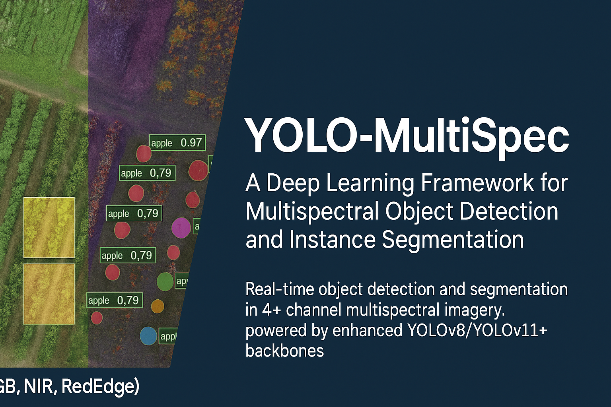

<head>
  <meta name="google-site-verification" content="xp43qbr5uV-p_JRFp70rsVyZ9hhMrhbfppkq6WXXiMs" />
  <meta name="description" content="YOLO-MultiSpec: Deep Learning Framework for Multispectral Object Detection and Instance Segmentation using enhanced YOLO architectures (YOLOv8/YOLOv11).">
  <meta name="keywords" content="YOLO, multispectral, object detection, instance segmentation, deep learning, remote sensing, precision agriculture, CBAM, ECA">
</head>


<p align="center">
  
</p>

# Welcome to YOLO-MultiSpec

YOLO-MultiSpec is an open-source deep learning framework for real-time multispectral object detection and instance segmentation.

## 🌟 Features
- 4+ channel multispectral input support (e.g., RGB + NIR + RedEdge)
- YOLOv8/YOLOv11-based backbone with CBAM and ECA attention
- Precision agriculture and drone imagery optimized
- Easy integration into QGIS and geospatial pipelines

## 🚀 Quick Start
See the [GitHub Repository](https://github.com/aesparon/YOLO-Multispec) to get started or view the [README](../README.md).

<p align="center">
  
</p>

## 📜 Citation (Coming Soon)
> “YOLO-MultiSpec: A Deep Learning Framework for Multispectral Object Detection and Instance Segmentation”  
> *Andrew Esparon, 2025, under review in Remote Sensing Letters*  
> GitHub: https://github.com/aesparon/YOLO-Multispec  
> DOI: (to be added upon publication)


```bibtex
@misc{yolo-multispec2025,
  title={YOLO-MultiSpec: A Deep Learning Framework for Multispectral Object Detection and Instance Segmentation},
  author={Esparon, Andrew},
  year={2025},
  howpublished={\url{https://github.com/aesparon/YOLO-Multispec}},
  note={Under review}
}
```

---

© 2025 Andrew Esparon  – [Charles Darwin University](https://www.cdu.edu.au)
